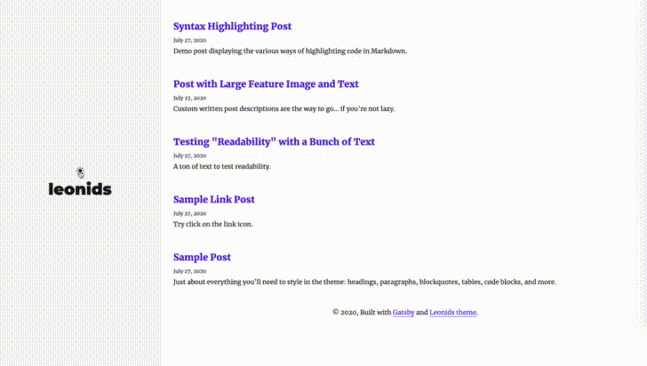
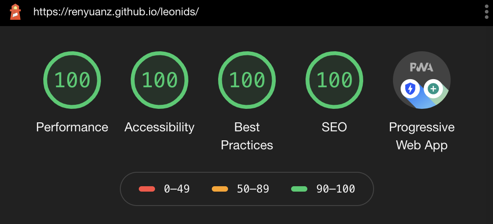

# Welcome to DripSource  
## Directory of useful tools and resources for the DRIP Networks Ecosystem

Greetings fellow DeFi-nauts and DRIP Community. Welcome to DripSource. Glad you made it.

Our goal is to provide value to our fellow Drippers and the broaders ecosystem. How you might ask? Great question. Share the best and most trusted resources

How?
Earning your trust. Being a god citizen of the DRIP Community.

Our mission to bring value to the DRIP community and the broader ecosystem. fw

aim is to share  share useful tools and resources

To our DRIP Network veterans, welcome. those who know, you know.

For the those who don't, welcome. By whatever fortunate means you have stumbled upon DR

By now, you've stumled into the Oasis in the DiFi desert

Below is an evergrowing list of tools and resources used by the DRIP community.

**[Leonids](http://renyuanz.github.io/leonids)** is a clean, fixed sidebar Gatsby starter which is perfect for powering your GitHub hosted blog.

**Balls**


### Preview



## What is Leonids?

A blazing fast static blog theme built on Gatsby.js



- Responsive templates. Looking good on any viewport.
- Fixed sidebar to provide a good navigation experience while reading.
- Light/Dark mode.
- **And** the Leonids (/ˈliːənɪdz/ lee-ə-nidz) are a prolific meteor shower associated with the comet [Tempel-Tuttle](https://en.wikipedia.org/wiki/55P/Tempel%E2%80%93Tuttle).

See a [demo](http://renyuanz.github.io/leonids/) hosted on GitHub pages.

## Getting Started (Recommended)

### Vercel.com deploy button

[](https://vercel.com/new/git/external?repository-url=https%3A%2F%2Fgithub.com%2Frenyuanz%2Fleonids)

### Netlify CMS deploy button

<a href="https://app.netlify.com/start/deploy?repository=https://github.com/renyuanz/leonids&amp;stack=cms"></a>

## Local development setup

```
gatsby new my-blog https://github.com/renyuanz/leonids
cd my-blog
gatsby develop
```

Check out your awesome blog at `http://localhost:8000` and Cheers!


## Legacy Jekyll theme

This project was a Jekyll blog theme, which is archived and not maintained any more. You can still find the source code in [leonids-jekyll](https://github.com/renyuanz/leonids/tree/leonids-jekyll) branch.
